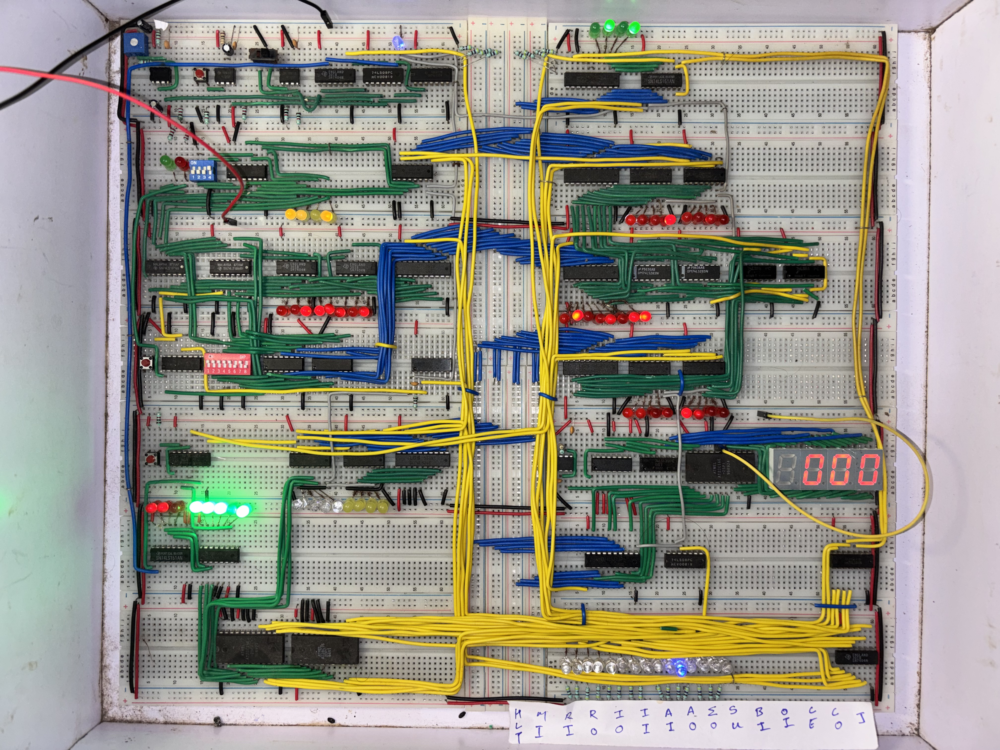
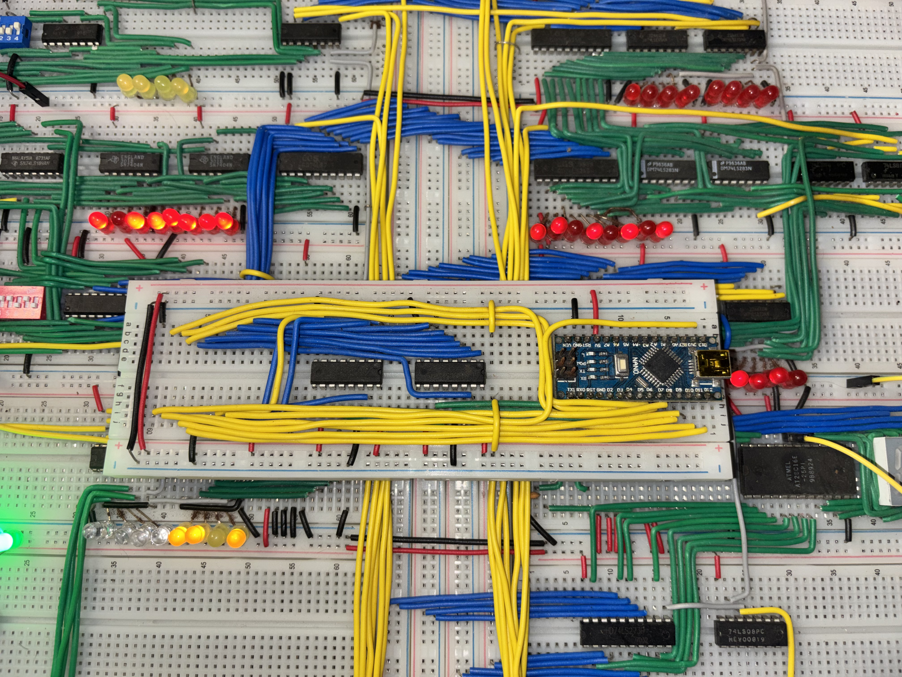

# My 8-Bit Computer

A custom-built 8-bit computer featuring a simple ALU, registers, RAM, and a basic instruction set.  
Built to explore how CPUs fetch, decode, and execute instructions from the ground up.

---

## Features
- 8-bit CPU with custom instruction set  
- ALU for arithmetic and logic operations  
- Registers and 16 bytes of RAM  
- Manual and automatic clock control  
- Can run small programs like counting, loops, and arithmetic

---

## Images

### Project Build
Full picture of the physical project:  

### Programming Setup
Arduino used as a programmer:  

---

## How It Works
This computer follows the fetch-decode-execute cycle:
1. **Fetch** – Load the instruction from memory  
2. **Decode** – Determine the operation  
3. **Execute** – Perform ALU operation, memory access, or jump  

---
